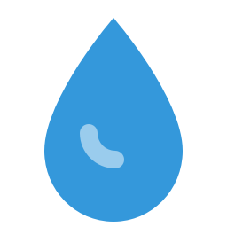

# 💧 HydrateMe

[](https://snapcraft.io/hydrateme)
[](https://github.com/devflow-karan/hydrateme)
[](LICENSE)
[]()
[]()

<p align="center">
  
</p>

<h3 align="center">Modern & Elegant Desktop Hydration Reminders for Linux</h3>

---

HydrateMe is a beautifully designed, lightweight desktop application engineered specifically for the modern Linux desktop (optimized for GNOME 47, Ubuntu 24.04, and Wayland sessions). It sits quietly in your system tray and periodically reminds you to drink water, helping you maintain healthy habits and boost productivity without cluttering your workspace.

---

## 🌟 Features

- **🎨 Modern Linux Styling**: Redesigned UI adhering to GNOME 47 / Ubuntu 24.04 HIG with premium dark/light cards, smooth toggle switches, and soft drop shadows.
- **🔄 Auto-Theme Detection**: Automatically detects system-wide dark or light mode preferences via D-Bus Settings portal queries.
- **🛎️ Smart Notifications**: Triggers native desktop notifications using XDG desktop portals or DBus alerts, adapting seamlessly even if your screen is locked.
- **🔊 Configurable Alarm Loops**: Periodically plays customizable reminder sounds (supports `.ogg`, `.wav`, and `.flac`) until you acknowledge you've hydrated.
- **⏰ Smart Snooze Option**: Instantly delay reminders by 15 minutes when in the middle of focused deep work.
- **🚀 Session Autostart**: Easily toggle autostart from settings to launch HydrateMe silently in the tray on desktop login (fully compatible with Flatpak and Snap sandboxing).
- **🔒 Single-Instance Lock**: Prevent background process duplication using robust file locks and local socket IPC.

---

## 📸 Screenshots

<p align="center">
  
  
</p>
<p align="center">
  
  
</p>

---

## 📦 Installation

### 1. From Snap Store (Recommended)
Building and installing the Snap ensures an isolated sandbox environment where all Qt6, DBus, and multimedia libraries are bundled internally. This works on **any** Linux distribution supporting Snaps (Ubuntu, Fedora, Arch, Debian, Mint).

```bash
sudo snap install hydrateme --channel=edge
```

### 2. From `.deb` Package (Debian / Ubuntu 24.04+)
Download the pre-compiled `.deb` package and install it via `apt` to resolve system dependencies automatically:

```bash
sudo apt update
sudo apt install ./hydrateme_1.4.0-1_all.deb
```

> [!NOTE]
> **Ubuntu 22.04 LTS Users**: The `python3-pyqt6` dependency is not available in Ubuntu 22.04 APT repositories. If installing on 22.04, use the **Snap package** (recommended) or manually install PyQt6 using pip (`pip3 install PyQt6`) before installing the `.deb`.

### 3. Build from Source (For Developers)

#### Prerequisites
Ensure you have Python (>= 3.10) and system dependencies installed:
```bash
sudo apt install python3-pip python3-venv libdbus-1-dev pkg-config python3-dev gcc libglib2.0-dev
```

#### Steps
1. Clone the repository:
   ```bash
   git clone https://github.com/devflow-karan/hydrateme.git
   cd hydrateme
   ```
2. Create and activate a virtual environment:
   ```bash
   python3 -m venv venv
   source venv/bin/activate
   ```
3. Install dependencies:
   ```bash
   pip install -e .
   ```
4. Run the application:
   ```bash
   python -m hydrateme
   ```

To run the unit tests:
```bash
pip install -e ".[dev]"
pytest
```

---

## 🛠️ Roadmap

- [ ] **Smart Hydration Goals**: Customize daily volume goals and log progress in settings.
- [ ] **Wellness Stats Dashboard**: Weekly and monthly metrics on your hydration consistency.
- [ ] **Weather & Activity Adjustments**: Dynamically scale reminder intervals based on local weather conditions.
- [ ] **Custom Reminders Schedules**: Set start/end hours to disable reminders automatically at night.
- [ ] **Achievement Badges**: Stay motivated with healthy habit milestones.

---

## 🤝 Contributing

Contributions make the open-source community an amazing place! Any contributions you make are **greatly appreciated**.

1. Fork the Project
2. Create your Feature Branch (`git checkout -b feature/AmazingFeature`)
3. Commit your Changes (`git commit -m 'Add some AmazingFeature'`)
4. Push to the Branch (`git push origin feature/AmazingFeature`)
5. Open a Pull Request

Please ensure that you run tests and format your code using `black` before submitting PRs!

---

## 📬 Contact

[](mailto:karankumarsacher@gmail.com)
[](https://www.linkedin.com/in/kkdev/)
[](https://github.com/devflow-karan)

---

## 📄 License

Distributed under the MIT License. See [LICENSE](file:///data/projects/2025/learningAI/HydrateMe/LICENSE) for more information.
